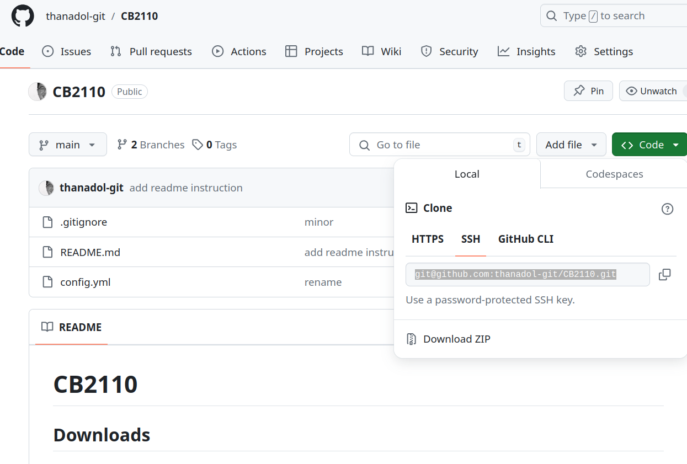

# CB2110

## Downloads
There are two softwares that we require for this course. Please follow the instructions below to download them.

1. [VS Code](https://code.visualstudio.com/download) 
2. [Conda](https://conda.io/projects/conda/en/latest/user-guide/install/index.html) 

## Steps 
Here we will show you how to setup the environment for this course. EVvery lab is base on R language and we will execute them through VScode with Conda environment. Please follow the instruction here for conda installation and then follow the instruction for VScode installation. 

1. Open your vscode. 

2. Clone this github repository to your local. Open terminal and change the directory to your local computer of choice. Run this command 

```
git clone <github repo link>
```
 
In this case the link should be `git@github.com:thanadol-git/CB2110.git`. You can also find it in the code/ssh tab. 



3. Set up conda environment. 
```
conda env create -f config.yml
```

4. Now, you should install your environment with the name `R-cb2110`. You can list your env with: 
```
conda env list 
```
5. Activate your environment. 
```
conda activate R-cb2110
```

6. Now, you have the environment ready. You should be able to work with every labs in this course. 
