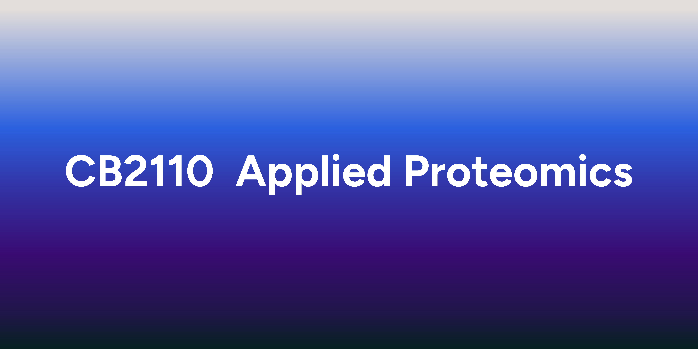
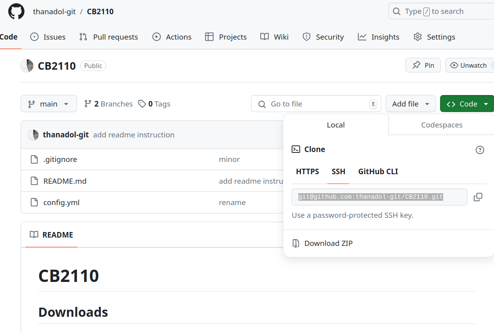

# CB2110



Welcome to CB2110 labs. Every material for every lab in this course can be found in this repository. We will enjoy proteomics with a bit of coding which will mainly be in `R`. If one would like to work with it locally, please try to set up the environment that you have here as you need in this course. What we need here is the environment so that you can execute the codes that we provide you during the lab. Nonetheless, it's possible to work on `Colab`. Once you finish the exercise, please just upload the worksheet in Canvas where we can grade you with a lot of points there. There usually be 10 questions in each lab with additional 3 bonus questions that can help you with your final grade. Don't worry if you need some help, as we are TAs, we are always available for assistance during the labs. Besides, you can also try it yourself in advance. We will announce through canvas when each lab is ready. Good luck and have fun.

## LABs
Please check the status of each lab here. 

|  Date (Time) | Lab | Submission | Comments |
|:-----|:-----| :--------:| :--------|
|8 Sept (8-12)| Lab 1   | `190925`|   `Ready`  |
|18 Sept (8-12)| Lab 2   | `250925`|  `Ready`  |
|25 Sept (8-12)| Lab 3   | `N/A`  | `N/A`  |  
|6 Oct (13-17)| Lab 4   | `N/A`  | `N/A`  |  

Usually, the lab will be available 2 days before the session. You are advised to work by yourself. The submission is always 1 weeks after the lab session. 

## Instructions

One can run quarto markdown (.qmd) file in vscode. One can open the lab folder and open the markdown file there. One should be able to see the code chunks and the questions. Please try to answer the questions in the markdown file. Once you finish, one can export it to html by clicking on the export button on the top right corner of the markdown file. Then, submit the html file to Canvas (Other files types would be fine).


## Working on Colab
If you don't wish to run it locally, you can also upload the adjacent file, `.quarto_ipynb` to [Google Colab](https://colab.research.google.com/) and run it there. You will need to install the packages in the first code chunk. Likewise, once you finish, you can download it as html and submit it to Canvas.

## Working locally
To run it locally, there are two softwares that we require. Please follow the instructions below to download them.

1. [VS Code](https://code.visualstudio.com/download) 
2. [Conda](https://conda.io/projects/conda/en/latest/user-guide/install/index.html) 

## Steps 
Here we will show you how to setup the environment for this course. Every lab is based on the R language and we will execute them through VScode with the Conda environment. Please follow the instruction here for conda installation and then follow the instruction for VScode installation. 

1. Open your vscode. 

2. Clone this github repository to your local. Open terminal and change the directory to your local computer of choice. Run this command. 

```
git clone <github repo link>
```
 
In this case the link should be `git@github.com:thanadol-git/CB2110.git`. You can also find it in the code/ssh tab. Similarly, you can basically download it directly from the github page in zip file.



3. Set up a conda environment. 
```
conda env create -f config.yml
```

4. Now, you should have installed this environment with the name `R-cb2110`. You can list your env with: 
```
conda env list 
```
5. Activate the environment. 
```
conda activate R-cb2110
```
6. Now, you have the environment ready. You should be able to work with every lab in this course. 

